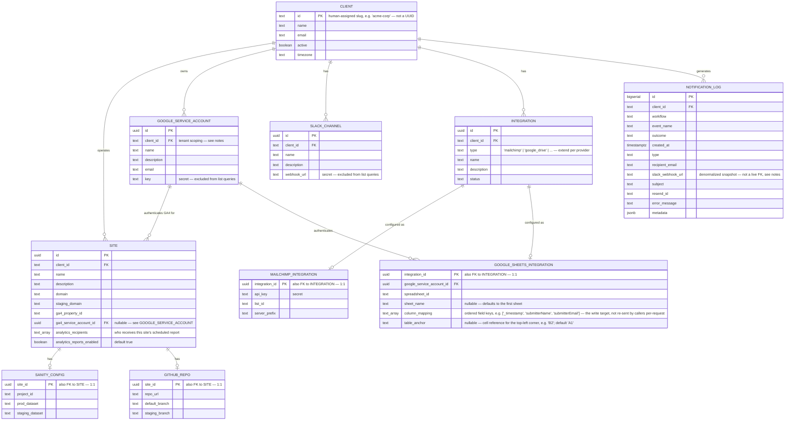

# Data Model: Client Data Model Rework

**Status**: Draft — design in progress, not yet implemented
**Branch**: `feat/006-client-data-model-rework`
**Purpose**: `clients` has accumulated a column per integration (`slack_webhook_url`,
`google_service_account_email`/`_key`, `ga4_property_id`) as each was added one at a time.
This document is the target entity model that replaces that pattern — normalized tables for
notification channels, third-party integrations, and (pending confirmation — see Open
Questions) per-site infrastructure — plus the migration/rollout plan to get there without
breaking `sol-notificaiton-service` or `sol-integration-service` mid-flight.

This is a **design artifact**, not yet a `/speckit.specify` feature spec. Once the entity
model below is confirmed, it becomes the `data-model.md` input to a proper spec/plan/tasks
cycle — the rollout is large enough to deserve its own `spec.md` with FRs, not just a
schema diagram.

## Full Entity-Relationship Diagram

## Entity Notes

### CLIENT

Trimmed to what's genuinely client-level: identity, contact `email`, active flag, timezone.
Everything that used to live here as a bolt-on column for one integration moves to a table
below. `default_email` is dropped — confirmed dead, not read by any live code path.

### SITE, SANITY_CONFIG, GITHUB_REPO

**Not yet confirmed for this wave — see Open Questions.** These model "a website belonging
to a client" as distinct from the client (business) itself, with GA4 config, CMS config,
and deploy config each broken out. `SANITY_CONFIG` and `GITHUB_REPO` are kept as separate
1:1 tables rather than inlined onto `SITE`, for the same reason `SLACK_CHANNEL`/`INTEGRATION`
are broken out of `CLIENT`: not every site has a tracked Sanity project or repo, and inlining
optional fields onto the core entity just relocates the sparse-column problem one table down.

`analytics_recipients`/`analytics_reports_enabled` move the weekly/monthly report's
recipient list and on/off toggle down from `client.settings.notifications.analytics_report`
(a JSONB sub-key with no real usage in current client data) to typed columns on `SITE` —
matching where `ga4_property_id` already lives, since a report is generated per site.

### GOOGLE_SERVICE_ACCOUNT

Standalone and referenceable, not owned by any single integration. This is the resolution to
an earlier design question in this thread: rather than each Google-touching integration
carrying its own nullable credential with an implicit "fall back to the client's default"
rule, two things that share a credential just point their FK at the same
`google_service_account` row. No runtime fallback logic anywhere — sharing is explicit.
`client_id` is included (not in the original sketch) purely for tenant-isolation
query-scoping, matching the constitution's "cross-tenant access must be architecturally
impossible" rule; it doesn't change how the table is used.

### SLACK_CHANNEL, INTEGRATION — no `is_default` column

Considered and rejected. Once a client can have more than one Slack channel or more than
one integration of the same provider, an implicit "default" flag means a caller can be
silently ambiguous about which one it means — and adding a second channel/integration for
an unrelated reason can silently change what an existing, unmodified caller resolves to.
Instead, the triggering event payload always names the specific channel/integration it
means, by `name`, with no fallback tier. Less convenient for the single-channel case, but
fully predictable — no resolution logic anywhere. This is a deliberate divergence from how
email recipients work (payload override with a schema-level fallback, per feature 017);
email and integration/channel selection are different enough problems that the
inconsistency is intentional, not an oversight.

### MAILCHIMP_INTEGRATION, GOOGLE_SHEETS_INTEGRATION

One child table per provider, keyed by `integration_id`, rather than a generic JSONB
`config` blob on `INTEGRATION` — matches the `SANITY_CONFIG`/`GITHUB_REPO` pattern and this
codebase's general preference for typed columns over polymorphic blobs. Adding a new
provider later means adding a new small table, not guessing at a shared shape.

`name`/`description` live on `INTEGRATION`, not on these child tables — they're
provider-agnostic, human-facing identification ("Main Newsletter List"), not
provider-specific connection data, so they belong on the shared registry row regardless of
which provider a given integration happens to use.

Note: `MAILCHIMP_INTEGRATION.api_key` is NOT extracted into a shared "Mailchimp account"
table the way Google's credential is. If it turns out clients commonly reuse one Mailchimp
account across several lists, that's a small, additive follow-up (extract a
`MAILCHIMP_ACCOUNT` table, same shape as `GOOGLE_SERVICE_ACCOUNT`) — not worth speculatively
building now with zero evidence it's needed.

`GOOGLE_SHEETS_INTEGRATION` — previously modeled as `GOOGLE_DRIVE_INTEGRATION` with a bare
`folder_id`, which matched the Drive *file-upload* API, not what this integration actually
does: append a row to a specific spreadsheet (the Sheets API). Corrected to carry
`spreadsheet_id`/`sheet_name`/`table_anchor`, matching what
`sol-notificaiton-service`'s legacy `GoogleSheetsDestination` payload (`spreadsheetId`,
`sheetName`, `columns`, `tableAnchor`) already proves is needed. `column_mapping` moves
that shape's `columns` (an ordered list of field keys) from a per-request, caller-supplied
value to integration-owned config, stored once against the target sheet — the same
principle as `SLACK_CHANNEL.webhook_url` or `GOOGLE_SERVICE_ACCOUNT.key`: data that's
inherent to one specific target belongs stored against that target, not re-sent by every
caller on every request. A caller sends a plain `fields` bag; `integration-service` maps
it into an ordered row using this table's stored `column_mapping`.

Note: this table already exists in the live database as `google_drive_integrations`
(Wave 1, migration `0004_thankful_iron_patriot.sql`) with the old `folder_id` shape — but
it has zero consumers (no API route yet exposes it, no caller reads or writes it), so the
rename/reshape is a cheap migration against empty, unused data. There is currently no
requirement for literal Google Drive file storage (uploading a file into a folder); if that
need arises later, it should be a new, separate table rather than re-overloading this one.

### NOTIFICATION_LOG

Unchanged. `slack_webhook_url` here is deliberately denormalized — it's a snapshot of what
was actually used at send time for audit purposes, not a live reference, so it's correct for
it to diverge from the current value in `SLACK_CHANNEL` after a channel is reconfigured.

## Open Questions

1. **Is `SITE`/`SANITY_CONFIG`/`GITHUB_REPO` in this migration wave, or a separate effort?**
   These model site/CMS/deploy infrastructure, a different concern from notification
   channels and third-party integrations. They also carry the biggest blast radius of
   anything here — `ga4_property_id` and `timezone` moving off `CLIENT` touches every
   existing Inngest event and function in `sol-notificaiton-service` that scopes by
   `clientId` today. Still open from earlier in this thread.
2. **Does any client actually have more than one site today?** If not, `SITE` is
   speculative normalization ahead of a real need — worth confirming before committing to
   the migration cost.

## Migration Waves (once Open Questions are resolved)

- **Wave 1 — Integrations & notification channels**: `GOOGLE_SERVICE_ACCOUNT`,
  `SLACK_CHANNEL`, `INTEGRATION`, `MAILCHIMP_INTEGRATION`, `GOOGLE_SHEETS_INTEGRATION`
  (migrated from the live `google_drive_integrations` table — see its entity note).
  Unblocks the Mailchimp/Google Sheets integration-service work that motivated this rework.
- **Wave 2 (tentative) — Site infrastructure**: `SITE`, `SANITY_CONFIG`, `GITHUB_REPO`,
  plus migrating `ga4_property_id` and the Google service account off `CLIENT` onto `SITE`.
  Larger blast radius; likely deserves its own spec independent of Wave 1's timeline.

Rollout for whichever wave: expand (new tables + backfill) → reconcile backfill against old
columns → cut existing API reads *and* writes over to new tables (contract unchanged) →
drop dead old columns → update the contract to expose new capabilities → update
`sol-notificaiton-service`/`sol-integration-service` to use them.

## Wave 1 Rollout Progress

This is a living tracker — update the Status column as each step lands, rather than
treating this as a point-in-time snapshot. Steps 1–6 are additive/zero-risk (no API
contract change, old columns and read/write paths untouched); step 7 onward changes actual
behavior and gets its own branch(es).

| # | Step | Status | Where |
|---|------|--------|-------|
| 1 | Agree on target ERD | ✅ Done | This document |
| 2 | Expand — add the 5 new tables + migration | ✅ Done | `feat/data-model-redesign`, commit `0cf8c0a` (`0004_thankful_iron_patriot.sql`) |
| 3 | Drop confirmed-dead `default_email` (unrelated cleanup, bundled in) | ✅ Done | Same commit, `0cf8c0a` |
| 4 | Expand — backfill script (`google_service_accounts`, `slack_channels` from legacy columns) | ✅ Done | `feat/data-model-redesign`, commit `973764e` (`scripts/backfill-integrations.ts`) |
| 5 | Reconcile backfilled data against the legacy columns | ✅ Done | Same script/commit, `973764e` — built-in reconciliation pass |
| 6 | Wire the backfill into CI for every PR, staging, and production (temporary) | ✅ Done | `973764e` (`.github/workflows/release.yml`); PR pipeline added separately (`.github/workflows/pr.yml`) after noticing it wasn't exercised there |
| 7 | Cut over reads *and* writes to the new tables (API contract unchanged) | ✅ Done | `feat/legacy-column-cutover`, commit `b9bf4b8` |
| 8 | Drop the now-dead legacy columns (`slack_webhook_url`, `google_service_account_email`/`_key`); remove the temporary CI backfill step from step 6 | ✅ Done | `feat/legacy-column-drop` — migration `0005_icy_whizzer.sql`; `scripts/backfill-integrations.ts` deleted (its job is done and it referenced columns that no longer exist) |
| 9 | Update the API contract to expose the new capabilities (multiple channels/integrations, etc.) | ⬜ Not started, not currently scheduled | — |
| 10 | Update downstream callers (`sol-notificaiton-service`, `sol-integration-service`) to use the new contract | ⬜ Not started, not currently scheduled | — |
