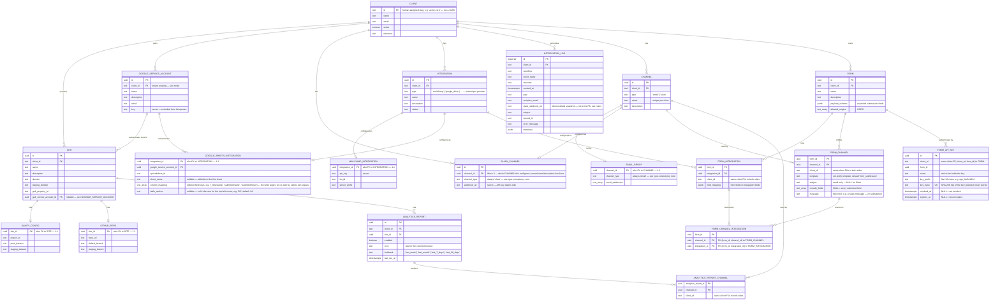

# Data Model: Client Data Model Rework

**Status**: Draft — design in progress, not yet implemented
**Branch**: `feat/006-client-data-model-rework`
**Purpose**: `clients` has accumulated a column per integration (`slack_webhook_url`,
`google_service_account_email`/`_key`, `ga4_property_id`) as each was added one at a time.
This document is the target entity model that replaces that pattern — normalized tables for
notification channels, third-party integrations, and (pending confirmation — see Open
Questions) per-site infrastructure — plus the migration/rollout plan to get there without
breaking `sol-notificaiton-service` or `sol-integration-service` mid-flight.

This is a **design artifact**, not yet a `/speckit.specify` feature spec. Once the entity
model below is confirmed, it becomes the `data-model.md` input to a proper spec/plan/tasks
cycle — the rollout is large enough to deserve its own `spec.md` with FRs, not just a
schema diagram.

## Full Entity-Relationship Diagram

```mermaid
erDiagram
    CLIENT ||--o{ SITE : "operates"
    CLIENT ||--o{ GOOGLE_SERVICE_ACCOUNT : "owns"
    CLIENT ||--o{ SLACK_CHANNEL : "has"
    CLIENT ||--o{ INTEGRATION : "has"
    CLIENT ||--o{ NOTIFICATION_LOG : "generates"

    SITE ||--o| SANITY_CONFIG : "has"
    SITE ||--o| GITHUB_REPO : "has"
    GOOGLE_SERVICE_ACCOUNT ||--o{ SITE : "authenticates GA4 for"

    INTEGRATION ||--o| MAILCHIMP_INTEGRATION : "configured as"
    INTEGRATION ||--o| GOOGLE_SHEETS_INTEGRATION : "configured as"
    GOOGLE_SERVICE_ACCOUNT ||--o{ GOOGLE_SHEETS_INTEGRATION : "authenticates"

    CLIENT ||--o{ CHANNEL : "has"
    CHANNEL ||--o| EMAIL_GROUP : "configured as"
    CHANNEL ||--o| SLACK_CHANNEL : "configured as"
    CLIENT ||--o{ FORM : "owns"
    FORM ||--o{ FORM_INTEGRATION : "runs"
    INTEGRATION ||--o{ FORM_INTEGRATION : "run by"
    FORM ||--o{ FORM_CHANNEL : "notifies"
    CHANNEL ||--o{ FORM_CHANNEL : "used by"
    FORM_CHANNEL ||--o{ FORM_CHANNEL_INTEGRATION : "reports on"
    FORM_INTEGRATION ||--o{ FORM_CHANNEL_INTEGRATION : "reported by"
    FORM ||--o{ FORM_API_KEY : "authenticated by"
    SITE ||--o{ ANALYTICS_REPORT : "has"
    ANALYTICS_REPORT ||--o{ ANALYTICS_REPORT_CHANNEL : "sends to"
    CHANNEL ||--o{ ANALYTICS_REPORT_CHANNEL : "used by"

    CLIENT {
        text id PK "human-assigned slug, e.g. 'acme-corp' — not a UUID"
        text name
        text email
        boolean active
        text timezone
    }

    SITE {
        uuid id PK
        text client_id FK
        text name
        text description
        text domain
        text staging_domain
        text ga4_property_id
        uuid ga4_service_account_id FK "nullable — see GOOGLE_SERVICE_ACCOUNT"
    }

    SANITY_CONFIG {
        uuid site_id PK "also FK to SITE — 1:1"
        text project_id
        text prod_dataset
        text staging_dataset
    }

    GITHUB_REPO {
        uuid site_id PK "also FK to SITE — 1:1"
        text repo_url
        text default_branch
        text staging_branch
    }

    GOOGLE_SERVICE_ACCOUNT {
        uuid id PK
        text client_id FK "tenant scoping — see notes"
        text name
        text description
        text email
        text key "secret — excluded from list queries"
    }

    SLACK_CHANNEL {
        uuid id PK
        uuid channel_id FK "Wave 3 — which CHANNEL this configures; owner/name/description live there"
        text channel_type "always 'slack' — see type-consistency note"
        text webhook_url "secret — API-key callers only"
    }

    INTEGRATION {
        uuid id PK
        text client_id FK
        text type "'mailchimp' | 'google_drive' | ... — extend per provider"
        text name
        text description
        text status
    }

    MAILCHIMP_INTEGRATION {
        uuid integration_id PK "also FK to INTEGRATION — 1:1"
        text api_key "secret"
        text list_id
        text server_prefix
    }

    GOOGLE_SHEETS_INTEGRATION {
        uuid integration_id PK "also FK to INTEGRATION — 1:1"
        uuid google_service_account_id FK
        text spreadsheet_id
        text sheet_name "nullable — defaults to the first sheet"
        text_array column_mapping "ordered field keys, e.g. ['_timestamp', 'submitterName', 'submitterEmail'] — the write target, not re-sent by callers per-request"
        text table_anchor "nullable — cell reference for the top-left corner, e.g. 'B2'; default 'A1'"
    }

    NOTIFICATION_LOG {
        bigserial id PK
        text client_id FK
        text workflow
        text event_name
        text outcome
        timestamptz created_at
        text type
        text recipient_email
        text slack_webhook_url "denormalized snapshot — not a live FK, see notes"
        text subject
        text resend_id
        text error_message
        jsonb metadata
    }

    CHANNEL {
        uuid id PK
        text client_id FK
        text type "'email' | 'slack'"
        text name "unique per client"
        text description
    }

    EMAIL_GROUP {
        uuid channel_id PK "also FK to CHANNEL — 1:1"
        text channel_type "always 'email' — see type-consistency note"
        text_array email_addresses
    }

    FORM {
        uuid id PK
        text client_id FK
        text name
        text description
        jsonb payload_schema "expected submission fields"
        text_array allowed_origins "CORS"
    }

    FORM_INTEGRATION {
        uuid form_id PK
        uuid integration_id PK
        text client_id "same-client FKs to both sides"
        jsonb field_mapping "form fields to integration fields"
    }

    FORM_CHANNEL {
        uuid form_id PK
        uuid channel_id PK
        text client_id "same-client FKs to both sides"
        text template "sol-notify template, default 'form_submission'"
        text subject "email only — NULL for Slack"
        text_array include_fields "NULL = every submitted field"
        text message "fixed text, e.g. a Slack message — no substitution"
    }

    FORM_CHANNEL_INTEGRATION {
        uuid form_id PK
        uuid channel_id PK "FK (form_id, channel_id) to FORM_CHANNEL"
        uuid integration_id PK "FK (form_id, integration_id) to FORM_INTEGRATION"
    }

    FORM_API_KEY {
        uuid id PK
        text client_id "same-client FK (client_id, form_id) to FORM"
        uuid form_id
        text name "which site holds the key"
        text key_prefix "first 12 chars, e.g. sgk_AbCd1234"
        text key_hash UK "SHA-256 hex of the key; plaintext never stored"
        timestamptz revoked_at "NULL = not revoked"
        timestamptz expires_at "NULL = never expires"
    }

    ANALYTICS_REPORT {
        uuid id PK
        text client_id FK
        uuid site_id FK
        boolean enabled
        text cron "read in the client's timezone"
        text lookback "'last_week' | 'last_month' | 'last_7_days' | 'last_28_days'"
        timestamptz last_run_at
    }

    ANALYTICS_REPORT_CHANNEL {
        uuid analytics_report_id PK
        uuid channel_id PK
        text client_id "same-client FKs to both sides"
    }
```

## Entity Notes

### CLIENT

Trimmed to what's genuinely client-level: identity, contact `email`, active flag, timezone.
Everything that used to live here as a bolt-on column for one integration moves to a table
below. `default_email` is dropped — confirmed dead, not read by any live code path.

### SITE, SANITY_CONFIG, GITHUB_REPO

These model "a website belonging to a client" as distinct from the client (business) itself,
with GA4 config, CMS config, and deploy config each broken out. `SANITY_CONFIG` and
`GITHUB_REPO` are kept as separate 1:1 tables rather than inlined onto `SITE`, for the same
reason `SLACK_CHANNEL`/`INTEGRATION` are broken out of `CLIENT`: not every site has a tracked
Sanity project or repo, and inlining optional fields onto the core entity just relocates the
sparse-column problem one table down.

(Superseded in Wave 3: these two columns moved to `ANALYTICS_REPORT`/
`ANALYTICS_REPORT_CHANNEL` and were dropped — see that entity note. Kept below as history.)
`analytics_recipients`/`analytics_reports_enabled` move the weekly/monthly report's
recipient list and on/off toggle down from `client.settings.notifications.analytics_report`
(a JSONB sub-key with no real usage in current client data) to typed columns on `SITE` —
matching where `ga4_property_id` already lives, since a report is generated per site.

Resolution of Open Question 2 (SOL-6): queried production — only 2 clients exist
(`hwhomes`, `sol`), each with exactly one `ga4_property_id` and one `google_service_accounts`
row, and neither has `sanity_project_id`/`github_repo` populated at all. So no client
operates more than one site today. Proceeding with the normalized model anyway rather than
deferring it: the notification-service target design (see the Miro board's Analytics
Scheduler frames) already calls `GET /v1/sites` and reads `site.analytics_recipients`/
`site.analytics_reports_enabled` — fields that don't exist as legacy columns anywhere, so
they need a home regardless — and the migration is cheap while there are only 2 rows to
backfill. `SITE`/`SANITY_CONFIG`/`GITHUB_REPO` are provisioned in this wave (`feat/SOL-6-finsh-erd`);
`CLIENT.ga4_property_id` stays in place for now — this ticket is the expand step only, not
the read/write cutover (see Wave 2 Rollout Progress below).

### GOOGLE_SERVICE_ACCOUNT

Standalone and referenceable, not owned by any single integration. This is the resolution to
an earlier design question in this thread: rather than each Google-touching integration
carrying its own nullable credential with an implicit "fall back to the client's default"
rule, two things that share a credential just point their FK at the same
`google_service_account` row. No runtime fallback logic anywhere — sharing is explicit.
`client_id` is included (not in the original sketch) purely for tenant-isolation
query-scoping, matching the constitution's "cross-tenant access must be architecturally
impossible" rule; it doesn't change how the table is used.

### SLACK_CHANNEL, INTEGRATION — no `is_default` column

Considered and rejected. Once a client can have more than one Slack channel or more than
one integration of the same provider, an implicit "default" flag means a caller can be
silently ambiguous about which one it means — and adding a second channel/integration for
an unrelated reason can silently change what an existing, unmodified caller resolves to.
Instead, the triggering event payload always names the specific channel/integration it
means, by `name`, with no fallback tier. Less convenient for the single-channel case, but
fully predictable — no resolution logic anywhere. This is a deliberate divergence from how
email recipients work (payload override with a schema-level fallback, per feature 017);
email and integration/channel selection are different enough problems that the
inconsistency is intentional, not an oversight.

### MAILCHIMP_INTEGRATION, GOOGLE_SHEETS_INTEGRATION

One child table per provider, keyed by `integration_id`, rather than a generic JSONB
`config` blob on `INTEGRATION` — matches the `SANITY_CONFIG`/`GITHUB_REPO` pattern and this
codebase's general preference for typed columns over polymorphic blobs. Adding a new
provider later means adding a new small table, not guessing at a shared shape.

`name`/`description` live on `INTEGRATION`, not on these child tables — they're
provider-agnostic, human-facing identification ("Main Newsletter List"), not
provider-specific connection data, so they belong on the shared registry row regardless of
which provider a given integration happens to use.

Note: `MAILCHIMP_INTEGRATION.api_key` is NOT extracted into a shared "Mailchimp account"
table the way Google's credential is. If it turns out clients commonly reuse one Mailchimp
account across several lists, that's a small, additive follow-up (extract a
`MAILCHIMP_ACCOUNT` table, same shape as `GOOGLE_SERVICE_ACCOUNT`) — not worth speculatively
building now with zero evidence it's needed.

`GOOGLE_SHEETS_INTEGRATION` — previously modeled as `GOOGLE_DRIVE_INTEGRATION` with a bare
`folder_id`, which matched the Drive *file-upload* API, not what this integration actually
does: append a row to a specific spreadsheet (the Sheets API). Corrected to carry
`spreadsheet_id`/`sheet_name`/`table_anchor`, matching what
`sol-notificaiton-service`'s legacy `GoogleSheetsDestination` payload (`spreadsheetId`,
`sheetName`, `columns`, `tableAnchor`) already proves is needed. `column_mapping` moves
that shape's `columns` (an ordered list of field keys) from a per-request, caller-supplied
value to integration-owned config, stored once against the target sheet — the same
principle as `SLACK_CHANNEL.webhook_url` or `GOOGLE_SERVICE_ACCOUNT.key`: data that's
inherent to one specific target belongs stored against that target, not re-sent by every
caller on every request. A caller sends a plain `fields` bag; `integration-service` maps
it into an ordered row using this table's stored `column_mapping`.

Note: this table already exists in the live database as `google_drive_integrations`
(Wave 1, migration `0004_thankful_iron_patriot.sql`) with the old `folder_id` shape — but
it has zero consumers (no API route yet exposes it, no caller reads or writes it), so the
rename/reshape is a cheap migration against empty, unused data. There is currently no
requirement for literal Google Drive file storage (uploading a file into a folder); if that
need arises later, it should be a new, separate table rather than re-overloading this one.

### CHANNEL, EMAIL_GROUP (Wave 3)

A channel is a named, client-owned place a notification can go ("Sales team", "#leads"),
*configured as* exactly one `EMAIL_GROUP` or `SLACK_CHANNEL` — the same pattern as
`INTEGRATION` → `MAILCHIMP_INTEGRATION`/`GOOGLE_SHEETS_INTEGRATION`. Forms and analytics
reports link to channels many-to-many, so "who can this form ever notify?" is answered
structurally by its links, and a channel reused by several forms is edited in one place.
Designed in the Sol Gate work (SOL-35; design notes in the sol-brain vault, `sol-gate/`).

`EMAIL_GROUP` is a 1:1 extension keyed by `channel_id` — reuse happens at the channel level,
so a group never needs to be shared on its own. Addresses are a plain `text[]` (like
`analytics_recipients`); a member table is only worth it if per-address state (bounces,
unsubscribes) is ever needed.

`SLACK_CHANNEL` predates channels, so rather than being re-keyed it gains a `channel_id`
(its own `id` is still what `/v1/clients/:clientId/slack-channels/:channelId` takes) and
becomes just the Slack-specific part — the webhook — like `EMAIL_GROUP`. Its `client_id`,
`name` and `description` moved to `CHANNEL`: migration `0010` copies each Slack channel
into a `channels` row (a client's same-named duplicates get " (2)", " (3)"…) and `0011`
drops the columns. The `/v1` route reads owner/name/description through the channel
(response unchanged); the legacy routes find, update and remove a client's Slack channel
through `channels`, and create a "Default" channel alongside each Slack row.

**Type consistency.** An `EMAIL_GROUP` must configure an email channel and a `SLACK_CHANNEL`
a Slack channel, and a channel can't have both. Enforced with the same composite-FK trick
as same-client scoping: `CHANNEL` has `UNIQUE (id, type)`, and each extension table carries
a `channel_type` column pinned by a `CHECK` to its own type, with an FK
`(channel_id, channel_type)` → `CHANNEL (id, type)`. Since a channel has exactly one type,
it can only ever be configured by the matching table; changing a configured channel's type
is rejected too. (What this can't express is *completeness* — that every channel has its
configuration row. `0010`'s self-check covers the migrated data; code that creates
channels must create both rows together.)

This doesn't reintroduce the rejected `is_default` idea: each client gets a *named*
"Client email" channel (holding `clients.email`) — created by `0010` for existing clients
and by the legacy create route for new ones, and kept in step when the legacy update route
changes the client's email — but nothing
resolves to it implicitly — a form or report notifies it only if explicitly linked to it.

### FORM, FORM_INTEGRATION, FORM_CHANNEL (Wave 3)

The configuration behind Sol Gate, the planned public front door for client websites
(SOL-38). A website submits to a form by ID and supplies only field values; everything else
— which integrations run (`FORM_INTEGRATION`), who is notified and how (`FORM_CHANNEL`) —
comes from these rows, so a public caller can never choose recipients. `payload_schema`
validates submissions; `allowed_origins` drives CORS.

Per-link settings live on the link, not the form: `FORM_INTEGRATION.field_mapping` (so two
forms can feed one integration with different field names; its shape depends on the
integration type) and `FORM_CHANNEL`'s `template`/`subject`/`include_fields`/`message`.
These are data, not free-text templates — rendering stays in sol-notify's code-level
template registry, and `message` is a fixed string with no substitution.

`FORM_CHANNEL_INTEGRATION` says **which of the form's integrations a notification reports
on** — a many-to-many *inside* the `FORM_CHANNEL` link, so it's a child table rather than a
column: a `uuid[]` couldn't carry foreign keys. Its two FKs guarantee a notification can only
report integrations the form actually runs (`→ FORM_INTEGRATION`) for a channel the form
actually notifies (`→ FORM_CHANNEL`); same-client scoping follows from both parents.

**Reporting is opt-in:** no rows for a `FORM_CHANNEL` means the notification reports on **no**
integrations — a notification can have nothing to do with them (e.g. "form 01 just ran
successfully!"). To report on every integration, list each one; a notification never reports
on an integration nobody explicitly linked to it.

**When notifications fire:** for now, only when the form's integrations succeed. Failure
notifications (and a per-link `notify_on`) are deliberately deferred.

**Worked example — "Form 01":** a form appending to Mailchimp (email, first and last name)
and to a Google Sheet (all six fields), then notifying three channels:

| Row | Content |
|---|---|
| `FORM` | `payload_schema` requiring `firstName`, `lastName`, `email`; optional `interestedIn`, `budget`, `comment` |
| `FORM_INTEGRATION` → Mailchimp | `field_mapping` `{"email": "email", "mergeFields": {"FNAME": "firstName", "LNAME": "lastName"}}` |
| `FORM_INTEGRATION` → Google Sheets | `field_mapping` `{"columns": ["firstName", "lastName", "email", "interestedIn", "budget", "comment"]}` |
| `FORM_CHANNEL` → Email group 01 | subject "New Mailchimp subscriber", `include_fields` `{firstName, lastName, email}` |
| `FORM_CHANNEL` → Email group 02 | subject "Form 01 submission", `include_fields` NULL (all) |
| `FORM_CHANNEL` → Slack `#leads` | subject NULL, `message` "form 01 just ran successfully!" |
| `FORM_CHANNEL_INTEGRATION` | (group 01, Mailchimp); (group 02, Mailchimp); (group 02, Google Sheets) — no rows for Slack, so its message reports on no integrations |

Not yet expressible: combining fields into one integration field (e.g. a single `NAME`
merge field holding "first last") — `field_mapping` maps field to field. A small fixed set of
transforms can be added when a client needs it.

A form belongs to a **client**, not a site: it's a protected endpoint the client
configures, which may not map to any one website. Where it can be called from is
`allowed_origins`, not a site relationship. If grouping forms by site is ever wanted, an
optional `site_id` can be added then.

### FORM_API_KEY (SOL-42)

Per-form API keys for Sol Gate's callers (client Next.js servers), replacing one key per
environment for every form: a leaked key only grants "submit to this one form", and a form
can hold several keys, so rotation needs no downtime (create the new key, deploy it, revoke
the old one).

- **Format:** `sgk_` + 32 random bytes, base64url (47 characters). The prefix makes keys
  easy to spot, including for secret scanners. `key_prefix` holds the first 12 characters
  for recognizing a key in lists and logs.
- **Only the SHA-256 is stored** (`key_hash`, `UNIQUE`). The keys are 256-bit random values,
  not passwords, so bcrypt/scrypt would add nothing (and they're slow on Workers). The
  plaintext appears once, in the create response.
- **Revoking is a soft delete** (`revoked_at`) that keeps the audit trail. `expires_at` is
  optional. A key is *active* when it's neither revoked nor expired (checked against the
  database clock).
- **sol-api verifies; hashes never leave it.** Sol Gate sends the key it received to the
  verify endpoint and gets back only yes/no (plus the matched key's id, for its logs).
  sol-api hashes the key and looks it up by the `UNIQUE key_hash` index, scoped to the
  client, form and active keys. No response ever contains a key hash, so there's nothing
  for a caller to log, cache or pass on by mistake. The cost is one extra internal call per
  submission, which Sol Gate can run alongside the form lookup.

### ANALYTICS_REPORT, ANALYTICS_REPORT_CHANNEL (Wave 3)

Replaces the dropped `SITE.analytics_recipients`/`analytics_reports_enabled` with a report per site that
has its own schedule (`cron`, in the client's timezone), period (`lookback`, a named preset
rather than a raw duration) and channels. The column is `lookback`, not `window` — `window`
is a reserved word in Postgres. `last_run_at` lets a fixed-interval scheduler tick skip
reports it already sent.

`0010` created one per site, linked to an "Analytics: <site>" email channel holding the
old recipients — or, when there were none, to the client's "Client email" channel (where the
old service's recipient fallback ended up). Schedule matches the old Inngest job exactly: `0 9 * * 2` (Tuesdays 9am client-local —
the old job fired Tuesday 00:00 UTC and slept until the next 9am business day) with
`last_week`. The old service's weekend/holiday skipping is not modeled; the new scheduler
(SOL-12) decides whether to keep it.

### Reading the Wave 3 tables (SOL-36)

Read-only `/v1` endpoints (no create/update yet):

| Endpoint | Exposes | For |
|---|---|---|
| `GET /v1/clients/:clientId/forms/:formId` | `FORM` + its `FORM_INTEGRATION`s (with `fieldMapping`) + `FORM_CHANNEL`s (with `integrationIds` from `FORM_CHANNEL_INTEGRATION`; empty = none (opt-in)). Client-scoped (a form under the wrong client is a 404) — Sol Gate's public URL carries both ids. No credentials. | Sol Gate |
| `GET /v1/clients/:clientId/channels?ids=…` | A client's `CHANNEL`s, each with what's needed to deliver to it: `EMAIL_GROUP.email_addresses` or `SLACK_CHANNEL.webhook_url` | Resolving channels to recipients (Sol Gate, scheduler) |
| `GET /v1/clients/:clientId/channels/:channelId` | One channel, same shape as the list (webhooks returned like an integration's credentials — every caller already holds the API key) | sol-notify's Slack lookup (SOL-13) |
| `GET /v1/analytics-reports?enabled=&active=` | `ANALYTICS_REPORT`s with site, GA4 property, client timezone and `channelIds`. Flat, cross-tenant, like `/v1/sites`. | Analytics scheduler (SOL-12) |

`FORM_API_KEY` (SOL-42) adds the first write endpoints on the Wave 3 tables. All are
client-scoped (a form under the wrong client is a 404):

| Endpoint | Does | For |
|---|---|---|
| `POST /v1/clients/:clientId/forms/:formId/api-keys` `{ name, expiresAt? }` | Creates a key → `201 { id, name, keyPrefix, key, createdAt, expiresAt }`. The only response that ever contains the plaintext `key`. | Setting up a site |
| `GET /v1/clients/:clientId/forms/:formId/api-keys` | Every key, revoked and expired included: `{ id, name, keyPrefix, createdAt, revokedAt, expiresAt }`. Never the key or its hash. | Admin |
| `DELETE /v1/clients/:clientId/forms/:formId/api-keys/:keyId` | Sets `revoked_at` → `204`. Idempotent (keeps the original `revokedAt`). | Rotation |
| `POST /v1/clients/:clientId/forms/:formId/api-keys/verify` `{ key }` | Always `200`: `{ authenticated: true, keyId }` for an active key of this client's form, else `{ authenticated: false }`. An unknown or other client's form is `false`, not a 404, so it doesn't reveal which forms exist. A wrong key isn't a 401, which here means sol-api's own `X-API-Key` was rejected. | Sol Gate |

### Same-client composite FKs (Wave 3)

Every table something links *to* (`SITE`, `INTEGRATION`, `CHANNEL`, `FORM`,
`ANALYTICS_REPORT`) has `UNIQUE (client_id, id)`, and every link row carries its own
`client_id` with composite FKs to both sides. A row joining one client's form to another
client's channel or integration is rejected by the database, not just by application code.
The same applies to `ANALYTICS_REPORT` → `SITE`.

### NOTIFICATION_LOG

Unchanged. `slack_webhook_url` here is deliberately denormalized — it's a snapshot of what
was actually used at send time for audit purposes, not a live reference, so it's correct for
it to diverge from the current value in `SLACK_CHANNEL` after a channel is reconfigured.

## Open Questions

1. ~~**Is `SITE`/`SANITY_CONFIG`/`GITHUB_REPO` in this migration wave, or a separate
   effort?**~~ Resolved (SOL-6): they're Wave 2, expand step only — new tables provisioned
   now, read/write cutover (moving `ga4_property_id` off `CLIENT`) is a later, separate step
   given its blast radius (touches every existing Inngest event/function in
   `sol-notificaiton-service` that scopes by `clientId` today).
2. ~~**Does any client actually have more than one site today?**~~ Resolved (SOL-6): no —
   see the resolution note under `SITE, SANITY_CONFIG, GITHUB_REPO` below. Building the
   normalized model anyway since the notification-service target design already depends on
   it and the migration is cheap at 2 rows.

## Migration Waves

- **Wave 1 — Integrations & notification channels**: `GOOGLE_SERVICE_ACCOUNT`,
  `SLACK_CHANNEL`, `INTEGRATION`, `MAILCHIMP_INTEGRATION`, `GOOGLE_SHEETS_INTEGRATION`
  (migrated from the live `google_drive_integrations` table — see its entity note).
  Unblocks the Mailchimp/Google Sheets integration-service work that motivated this rework.
- **Wave 2 — Site infrastructure**: `SITE`, `SANITY_CONFIG`, `GITHUB_REPO`. Expand step
  (new tables + backfill) landing in SOL-6; migrating `ga4_property_id` and the Google
  service account off `CLIENT` onto `SITE` (the cutover + drop steps) is separate follow-up
  work, given its blast radius.

- **Wave 3 — Channels, forms and analytics reports** (SOL-35): `CHANNEL`, `EMAIL_GROUP`,
  `FORM`, `FORM_INTEGRATION`, `FORM_CHANNEL`, `ANALYTICS_REPORT`, `ANALYTICS_REPORT_CHANNEL`,
  plus `SLACK_CHANNEL.channel_id`. Unlike Waves 1–2, done in one step: nothing calls the
  `/v1` routes yet, so there's no read cutover to stage — the data moves in SQL inside the
  migration, the legacy routes (the only live callers) are switched over in the same
  change, and the moved columns are dropped straight away.

Rollout for whichever wave: expand (new tables + backfill) → reconcile backfill against old
columns → cut existing API reads *and* writes over to new tables (contract unchanged) →
drop dead old columns → update the contract to expose new capabilities → update
`sol-notificaiton-service`/`sol-integration-service` to use them.

## Wave 1 Rollout Progress

This is a living tracker — update the Status column as each step lands, rather than
treating this as a point-in-time snapshot. Steps 1–6 are additive/zero-risk (no API
contract change, old columns and read/write paths untouched); step 7 onward changes actual
behavior and gets its own branch(es).

| # | Step | Status | Where |
|---|------|--------|-------|
| 1 | Agree on target ERD | ✅ Done | This document |
| 2 | Expand — add the 5 new tables + migration | ✅ Done | `feat/data-model-redesign`, commit `0cf8c0a` (`0004_thankful_iron_patriot.sql`) |
| 3 | Drop confirmed-dead `default_email` (unrelated cleanup, bundled in) | ✅ Done | Same commit, `0cf8c0a` |
| 4 | Expand — backfill script (`google_service_accounts`, `slack_channels` from legacy columns) | ✅ Done | `feat/data-model-redesign`, commit `973764e` (`scripts/backfill-integrations.ts`) |
| 5 | Reconcile backfilled data against the legacy columns | ✅ Done | Same script/commit, `973764e` — built-in reconciliation pass |
| 6 | Wire the backfill into CI for every PR, staging, and production (temporary) | ✅ Done | `973764e` (`.github/workflows/release.yml`); PR pipeline added separately (`.github/workflows/pr.yml`) after noticing it wasn't exercised there |
| 7 | Cut over reads *and* writes to the new tables (API contract unchanged) | ✅ Done | `feat/legacy-column-cutover`, commit `b9bf4b8` |
| 8 | Drop the now-dead legacy columns (`slack_webhook_url`, `google_service_account_email`/`_key`); remove the temporary CI backfill step from step 6 | ✅ Done | `feat/legacy-column-drop` — migration `0005_icy_whizzer.sql`; `scripts/backfill-integrations.ts` deleted (its job is done and it referenced columns that no longer exist) |
| 9 | Update the API contract to expose the new capabilities (multiple channels/integrations, etc.) | ⬜ Not started, not currently scheduled | — |

## Wave 2 Rollout Progress

Same living-tracker convention as Wave 1. Steps 1–4 are additive/zero-risk (no API contract
change, `CLIENT`'s legacy site columns and existing read/write paths untouched); the
read/write cutover and legacy-column drop are separate, later work (see Open Question 1's
resolution above).

| # | Step | Status | Where |
|---|------|--------|-------|
| 1 | Agree on target ERD | ✅ Done | This document / Miro board |
| 2 | Resolve open question — does any client have more than one site today? | ✅ Done — no | This document, `SITE, SANITY_CONFIG, GITHUB_REPO` entity notes |
| 3 | Expand — add the 3 new tables + migration | ✅ Done | `feat/SOL-6-finsh-erd` |
| 4 | Expand — backfill script (`sites` from `clients.ga4_property_id` + matching `google_service_accounts` row; nothing to backfill for `sanity_configs`/`github_repos` — no client has that data populated) | ✅ Done | `feat/SOL-6-finsh-erd`, `scripts/backfill-sites.ts` |
| 5 | Reconcile backfilled data against the legacy columns | ✅ Done | Same script — built-in reconciliation pass |
| 6 | Wire the backfill into CI for every PR, staging, and production (temporary) | ✅ Done | `.github/workflows/release.yml`, `.github/workflows/pr.yml` |
| 7 | Cut over reads *and* writes to `SITE` (API contract unchanged) | ✅ Done | `feat/SOL-22-cutover-site-reads-writes`, PR #24 — verified live in production (matched `clients`/`sites` `ga4_property_id` values, deploy succeeded) |
| 8 | Drop the now-dead `clients.ga4_property_id`/`sanity_*`/`github_*`; remove the temporary CI backfill step from step 6 | ✅ Done | `feat/SOL-22-drop-legacy-client-columns` — migration `0008_drop_legacy_client_columns.sql`; `scripts/backfill-sites.ts` deleted (its job is done and it referenced a column that no longer exists) |
| 9 | Update downstream callers (`sol-notificaiton-service`, `sol-integration-service`) to use the new contract | ⬜ Not started, not currently scheduled | — |

## Wave 3 Rollout Progress

Done as a single step rather than expand → backfill → cutover → drop: no service calls the
`/v1` routes yet, so the only live readers/writers (the legacy routes) are switched over in
the same change, and the data is copied in SQL inside the migration instead of a temporary
CI backfill script. Both migrations are single `DO` blocks, so each applies atomically.

| # | Step | Status | Where |
|---|------|--------|-------|
| 1 | Agree on target ERD | ✅ Done | Miro "sol-api Entity Model + forms and channels (proposed)"; sol-brain `sol-gate/03-data-model.md` |
| 2 | New tables (incl. `form_channel_integrations`), `slack_channels.channel_id`/`channel_type`, same-client and type-consistency composite FKs; copy Slack channels, default "Client email" channels and analytics reports into them; self-check | ✅ Done | `feat/SOL-35-forms-channels-schema` — `0010_forms_and_channels.sql` |
| 3 | Switch the legacy routes and `/v1` Slack/sites routes to the new tables; new clients get a default channel | ✅ Done | Same branch |
| 4 | Drop `slack_channels.client_id`/`name`/`description` and `sites.analytics_recipients`/`analytics_reports_enabled` | ✅ Done | Same branch — `0011_drop_moved_columns.sql` |
| 5 | New endpoints for Sol Gate / the analytics scheduler (load form, resolve channels, due reports) | ⬜ Not started | SOL-36 |
