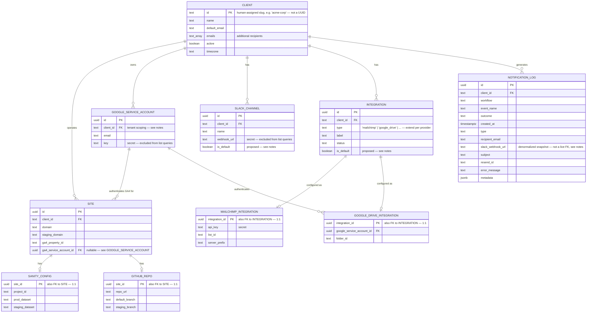

# Data Model: Client Data Model Rework

**Status**: Draft — design in progress, not yet implemented
**Branch**: `feat/006-client-data-model-rework`
**Purpose**: `clients` has accumulated a column per integration (`slack_webhook_url`,
`google_service_account_email`/`_key`, `ga4_property_id`) as each was added one at a time.
This document is the target entity model that replaces that pattern — normalized tables for
notification channels, third-party integrations, and (pending confirmation — see Open
Questions) per-site infrastructure — plus the migration/rollout plan to get there without
breaking `sol-notificaiton-service` or `sol-integration-service` mid-flight.

This is a **design artifact**, not yet a `/speckit.specify` feature spec. Once the entity
model below is confirmed, it becomes the `data-model.md` input to a proper spec/plan/tasks
cycle — the rollout is large enough to deserve its own `spec.md` with FRs, not just a
schema diagram.

## Full Entity-Relationship Diagram

## Entity Notes

### CLIENT

Trimmed to what's genuinely client-level: identity, default notification recipient(s),
active flag, timezone. Everything that used to live here as a bolt-on column for one
integration moves to a table below.

### SITE, SANITY_CONFIG, GITHUB_REPO

**Not yet confirmed for this wave — see Open Questions.** These model "a website belonging
to a client" as distinct from the client (business) itself, with GA4 config, CMS config,
and deploy config each broken out. `SANITY_CONFIG` and `GITHUB_REPO` are kept as separate
1:1 tables rather than inlined onto `SITE`, for the same reason `SLACK_CHANNEL`/`INTEGRATION`
are broken out of `CLIENT`: not every site has a tracked Sanity project or repo, and inlining
optional fields onto the core entity just relocates the sparse-column problem one table down.

### GOOGLE_SERVICE_ACCOUNT

Standalone and referenceable, not owned by any single integration. This is the resolution to
an earlier design question in this thread: rather than each Google-touching integration
carrying its own nullable credential with an implicit "fall back to the client's default"
rule, two things that share a credential just point their FK at the same
`google_service_account` row. No runtime fallback logic anywhere — sharing is explicit.
`client_id` is included (not in the original sketch) purely for tenant-isolation
query-scoping, matching the constitution's "cross-tenant access must be architecturally
impossible" rule; it doesn't change how the table is used.

### SLACK_CHANNEL, INTEGRATION — the `is_default` columns

**Proposed addition, not yet confirmed.** Once a client can have more than one Slack
channel or more than one integration of the same provider, something has to resolve "which
one" when a triggering event doesn't say. Proposal: one `is_default` per client per table
(enforce with a partial unique index, e.g. `UNIQUE (client_id) WHERE is_default`), with the
triggering event payload able to name a specific channel/integration by `label` to override
it — mirroring how email recipients already work (payload-level override, no schema
involvement, per feature 017). Needs explicit sign-off since it wasn't in the original
table sketch.

### MAILCHIMP_INTEGRATION, GOOGLE_DRIVE_INTEGRATION

One child table per provider, keyed by `integration_id`, rather than a generic JSONB
`config` blob on `INTEGRATION` — matches the `SANITY_CONFIG`/`GITHUB_REPO` pattern and this
codebase's general preference for typed columns over polymorphic blobs. Adding a new
provider later means adding a new small table, not guessing at a shared shape.

Note: `MAILCHIMP_INTEGRATION.api_key` is NOT extracted into a shared "Mailchimp account"
table the way Google's credential is. If it turns out clients commonly reuse one Mailchimp
account across several lists, that's a small, additive follow-up (extract a
`MAILCHIMP_ACCOUNT` table, same shape as `GOOGLE_SERVICE_ACCOUNT`) — not worth speculatively
building now with zero evidence it's needed.

### NOTIFICATION_LOG

Unchanged. `slack_webhook_url` here is deliberately denormalized — it's a snapshot of what
was actually used at send time for audit purposes, not a live reference, so it's correct for
it to diverge from the current value in `SLACK_CHANNEL` after a channel is reconfigured.

## Open Questions

1. **Is `SITE`/`SANITY_CONFIG`/`GITHUB_REPO` in this migration wave, or a separate effort?**
   These model site/CMS/deploy infrastructure, a different concern from notification
   channels and third-party integrations. They also carry the biggest blast radius of
   anything here — `ga4_property_id` and `timezone` moving off `CLIENT` touches every
   existing Inngest event and function in `sol-notificaiton-service` that scopes by
   `clientId` today. Still open from earlier in this thread.
2. **Does any client actually have more than one site today?** If not, `SITE` is
   speculative normalization ahead of a real need — worth confirming before committing to
   the migration cost.
3. **`is_default` on `SLACK_CHANNEL`/`INTEGRATION`** — confirm this is the right selection
   mechanism before it's built.

## Migration Waves (once Open Questions are resolved)

- **Wave 1 — Integrations & notification channels**: `GOOGLE_SERVICE_ACCOUNT`,
  `SLACK_CHANNEL`, `INTEGRATION`, `MAILCHIMP_INTEGRATION`, `GOOGLE_DRIVE_INTEGRATION`.
  Unblocks the Mailchimp/Google Drive integration-service work that motivated this rework.
- **Wave 2 (tentative) — Site infrastructure**: `SITE`, `SANITY_CONFIG`, `GITHUB_REPO`,
  plus migrating `ga4_property_id` and the Google service account off `CLIENT` onto `SITE`.
  Larger blast radius; likely deserves its own spec independent of Wave 1's timeline.

Rollout for whichever wave: expand (new tables + backfill) → reconcile backfill against old
columns → cut existing API reads *and* writes over to new tables (contract unchanged) →
drop dead old columns → update the contract to expose new capabilities → update
`sol-notificaiton-service`/`sol-integration-service` to use them.
